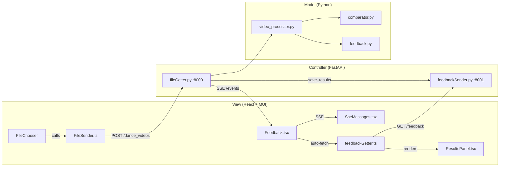

# API Walkthrough

Complete reference for the dance comparison API — every file, function, endpoint, and data flow.

---

## Architecture Overview



---

## Data Flow (Step by Step)

| Step | Component | Action |
|------|-----------|--------|
| 1 | [FileChooser.tsx](file:///c:/Users/marto/Documents/egyetem/szakdoga/szakdolgozat/view/src/components/FileChooser.tsx) | User selects teacher + student videos, clicks Submit |
| 2 | [FileSender.ts](file:///c:/Users/marto/Documents/egyetem/szakdoga/szakdolgozat/view/src/api/FileSender.ts) | `POST /dance_videos` sends files as `FormData` |
| 3 | [fileGetter.py](file:///c:/Users/marto/Documents/egyetem/szakdoga/szakdolgozat/controller/fileGetter.py) | Saves files, creates session dir, calls [process_videos()](file:///c:/Users/marto/Documents/egyetem/szakdoga/szakdolgozat/model/video_processor.py#9-56) |
| 4 | [video_processor.py](file:///c:/Users/marto/Documents/egyetem/szakdoga/szakdolgozat/model/video_processor.py) | Runs extraction → comparison → feedback generation |
| 5 | [video_processor.py](file:///c:/Users/marto/Documents/egyetem/szakdoga/szakdolgozat/model/video_processor.py) | Sends SSE status messages via `event_handler` callback |
| 6 | [Feedback.tsx](file:///c:/Users/marto/Documents/egyetem/szakdoga/szakdolgozat/view/src/components/Feedback.tsx) | Receives SSE messages, displays them in [SseMessages.tsx](file:///c:/Users/marto/Documents/egyetem/szakdoga/szakdolgozat/view/src/components/SseMessages.tsx) |
| 7 | [video_processor.py](file:///c:/Users/marto/Documents/egyetem/szakdoga/szakdolgozat/model/video_processor.py) | Sends `"Feedback ready."` SSE when done |
| 8 | [fileGetter.py](file:///c:/Users/marto/Documents/egyetem/szakdoga/szakdolgozat/controller/fileGetter.py) | Calls [save_results()](file:///c:/Users/marto/Documents/egyetem/szakdoga/szakdolgozat/controller/feedbackSender.py#54-86) → writes `results.json` to disk |
| 9 | [Feedback.tsx](file:///c:/Users/marto/Documents/egyetem/szakdoga/szakdolgozat/view/src/components/Feedback.tsx) | Detects `"Feedback ready."`, calls [getFeedback()](file:///c:/Users/marto/Documents/egyetem/szakdoga/szakdolgozat/view/src/api/feedbackGetter.ts#30-54) |
| 10 | [feedbackGetter.ts](file:///c:/Users/marto/Documents/egyetem/szakdoga/szakdolgozat/view/src/api/feedbackGetter.ts) | `GET /feedback` from [feedbackSender.py](file:///c:/Users/marto/Documents/egyetem/szakdoga/szakdolgozat/controller/feedbackSender.py) on port 8001 |
| 11 | [ResultsPanel.tsx](file:///c:/Users/marto/Documents/egyetem/szakdoga/szakdolgozat/view/src/components/ResultsPanel.tsx) | Renders scores, joint chips, and feedback cards |

---

## Backend: Controller Layer

### [fileGetter.py](file:///c:/Users/marto/Documents/egyetem/szakdoga/szakdolgozat/controller/fileGetter.py) — Port 8000

The main entry point. Handles video uploads and orchestrates processing.

#### `POST /dance_videos`

Accepts two video files (`teacher`, `student`) as multipart form data.

```python
async def upload_files(teacher: UploadFile, student: UploadFile)
```

**Flow:**
1. Saves uploaded files to `uploaded_videos/`
2. Creates a session directory: `data/YYYYMMDD_HHMMSS/`
3. Calls [process_videos()](file:///c:/Users/marto/Documents/egyetem/szakdoga/szakdolgozat/model/video_processor.py#9-56) which runs extraction → comparison → feedback
4. Calls [save_results(session_id, results)](file:///c:/Users/marto/Documents/egyetem/szakdoga/szakdolgozat/controller/feedbackSender.py#54-86) to persist as JSON
5. Returns JSON with `session_id`, scores, and feedback

**Response:**
```json
{
    "message": "Files uploaded and processed successfully",
    "session_id": "20260306_213000",
    "overall_score": 78.5,
    "skeleton_score": 82.1,
    "trajectory_score": 75.0,
    "mask_score": 71.3,
    "feedback": ["Good performance...", "⚠ Elbows scored 45%..."]
}
```

#### `GET /events`

Server-Sent Events endpoint. Streams real-time status messages during processing.

```python
async def event_generator()
```

Yields messages like:
- `"Starting video processing..."`
- `"Teacher video extracted."`
- `"Comparing performances..."`
- `"Feedback ready."`

Uses `asyncio.Queue` for message passing. Sends keep-alive comments every 1s.

---

### [feedbackSender.py](file:///c:/Users/marto/Documents/egyetem/szakdoga/szakdolgozat/controller/feedbackSender.py) — Port 8001

Serves persisted comparison results. Runs as a separate server.

#### `GET /feedback`

Returns scores + feedback messages for a session.

```python
async def get_feedback(session_id: str = Query(default=None))
```

- If `session_id` omitted → auto-picks the latest session
- Reads from `data/<session_id>/results.json`
- Returns subset: scores, `per_joint_scores`, [feedback](file:///c:/Users/marto/Documents/egyetem/szakdoga/szakdolgozat/controller/feedbackSender.py#91-126) messages

**Response:**
```json
{
    "session_id": "20260306_213000",
    "overall_score": 78.5,
    "skeleton_score": 82.1,
    "trajectory_score": 75.0,
    "mask_score": 71.3,
    "timing_cost": 0.234,
    "per_joint_scores": {"elbows": 45.0, "knees": 92.0, ...},
    "feedback": ["Good performance...", "⚠ Elbows scored 45%..."]
}
```

#### `GET /feedback/detailed`

Returns the full results including per-frame arrays (for charts/visualisation).

```python
async def get_detailed_feedback(session_id: str = Query(default=None))
```

Additional fields beyond `/feedback`: `alignment_path`, `worst_frames`, `per_frame_shape`, `energy_details`.

#### `GET /sessions`

Lists all available session IDs (reverse chronological).

```python
async def list_sessions()
```

**Response:**
```json
{ "sessions": ["20260306_213000", "20260305_140000"] }
```

#### [save_results(session_id, results)](file:///c:/Users/marto/Documents/egyetem/szakdoga/szakdolgozat/controller/feedbackSender.py#54-86)

Utility function (not an endpoint). Called by [fileGetter.py](file:///c:/Users/marto/Documents/egyetem/szakdoga/szakdolgozat/controller/fileGetter.py) after processing.

```python
def save_results(session_id, results)
```

- Creates `data/<session_id>/results.json`
- Converts numpy arrays to Python lists for JSON serialization
- Handles nested dicts (e.g. `energy_details`)

---

## Backend: Model Layer

### [video_processor.py](file:///c:/Users/marto/Documents/egyetem/szakdoga/szakdolgozat/model/video_processor.py)

Async orchestrator that ties extraction, comparison, and feedback together.

#### [process_videos(teacher_file, student_file, output_dir, config, event_handler)](file:///c:/Users/marto/Documents/egyetem/szakdoga/szakdolgozat/model/video_processor.py#9-56)

```python
async def process_videos(teacher_file, student_file, output_dir='data',
                         config=None, event_handler=None)
```

**Three phases:**
1. **Extraction** — Calls [data_extraction()](file:///c:/Users/marto/Documents/egyetem/szakdoga/szakdolgozat/model/extraction/extractor.py#13-150) for each video (in thread)
2. **Comparison** — Calls [compare_dances()](file:///c:/Users/marto/Documents/egyetem/szakdoga/szakdolgozat/model/comparison/comparator.py#19-116) → returns scores dict (in thread)
3. **Feedback** — Calls [generate_feedback(results, config)](file:///c:/Users/marto/Documents/egyetem/szakdoga/szakdolgozat/model/comparison/feedback.py#10-69) → attaches [feedback](file:///c:/Users/marto/Documents/egyetem/szakdoga/szakdolgozat/controller/feedbackSender.py#91-126) list

Sends SSE status messages via `event_handler` callback at each phase transition.

---

### [feedback.py](file:///c:/Users/marto/Documents/egyetem/szakdoga/szakdolgozat/model/comparison/feedback.py)

Rule-based feedback generator. Produces a prioritized list of English messages.

#### [generate_feedback(results, config) → list[str]](file:///c:/Users/marto/Documents/egyetem/szakdoga/szakdolgozat/model/comparison/feedback.py#10-69)

Analyses the comparison results dict and applies 7 rules in priority order:

| Rule | Function | Triggers when |
|------|----------|--------------|
| Overall summary | [_overall_summary(score)](file:///c:/Users/marto/Documents/egyetem/szakdoga/szakdolgozat/model/comparison/feedback.py#74-84) | Always |
| Joint warnings | [_joint_warnings(per_joint, threshold)](file:///c:/Users/marto/Documents/egyetem/szakdoga/szakdolgozat/model/comparison/feedback.py#86-102) | Any joint < 70% |
| Worst moment | [_worst_moment(worst_frames)](file:///c:/Users/marto/Documents/egyetem/szakdoga/szakdolgozat/model/comparison/feedback.py#104-115) | `worst_frames` is non-empty |
| Trajectory | [_trajectory_warning(score, threshold)](file:///c:/Users/marto/Documents/egyetem/szakdoga/szakdolgozat/model/comparison/feedback.py#117-127) | Score < 70% |
| Silhouette | [_shape_warning(mask_score, threshold)](file:///c:/Users/marto/Documents/egyetem/szakdoga/szakdolgozat/model/comparison/feedback.py#129-138) | Score < 60% |
| Energy mismatch | [_energy_mismatch(energy_details)](file:///c:/Users/marto/Documents/egyetem/szakdoga/szakdolgozat/model/comparison/feedback.py#140-170) | Ratio < 0.6 or > 1.6 |
| Praise | [_praise(skel, traj, mask, threshold)](file:///c:/Users/marto/Documents/egyetem/szakdoga/szakdolgozat/model/comparison/feedback.py#172-182) | Any component ≥ 90% |

Thresholds are configurable via [ComparisonConfig](file:///c:/Users/marto/Documents/egyetem/szakdoga/szakdolgozat/model/config.py#48-128) fields: `feedback_joint_warn_threshold`, `feedback_direction_warn_threshold`, `feedback_mask_warn_threshold`, `feedback_praise_threshold`.

---

## Frontend: API Layer

### [FileSender.ts](file:///c:/Users/marto/Documents/egyetem/szakdoga/szakdolgozat/view/src/api/FileSender.ts)

Uploads video files to the backend.

#### [sendFiles(teacherFile: File, studentFile: File)](file:///c:/Users/marto/Documents/egyetem/szakdoga/szakdolgozat/view/src/api/FileSender.ts#1-24)

- `POST http://localhost:8000/dance_videos`
- Sends as `FormData` with keys `teacher` and `student`
- Returns the JSON response (scores + feedback)

---

### [feedbackGetter.ts](file:///c:/Users/marto/Documents/egyetem/szakdoga/szakdolgozat/view/src/api/feedbackGetter.ts)

Fetches comparison results from [feedbackSender.py](file:///c:/Users/marto/Documents/egyetem/szakdoga/szakdolgozat/controller/feedbackSender.py).

#### Types

```typescript
interface FeedbackResponse {
    session_id: string;
    overall_score: number;
    skeleton_score: number;
    trajectory_score: number;
    mask_score: number;
    timing_cost: number;
    per_joint_scores: Record<string, number>;
    feedback: string[];
}

interface DetailedFeedbackResponse extends FeedbackResponse {
    alignment_path: [number, number][];
    worst_frames: [number, string, number][];
    per_frame_shape: number[];
    energy_details: { energy_score, per_frame_ratios, teacher_energy, student_energy };
}
```

#### Functions

| Function | Endpoint | Returns |
|----------|----------|---------|
| [getFeedback(sessionId?)](file:///c:/Users/marto/Documents/egyetem/szakdoga/szakdolgozat/view/src/api/feedbackGetter.ts#30-54) | `GET /feedback` | [FeedbackResponse](file:///c:/Users/marto/Documents/egyetem/szakdoga/szakdolgozat/view/src/api/feedbackGetter.ts#5-15) |
| [getDetailedFeedback(sessionId?)](file:///c:/Users/marto/Documents/egyetem/szakdoga/szakdolgozat/view/src/api/feedbackGetter.ts#55-79) | `GET /feedback/detailed` | [DetailedFeedbackResponse](file:///c:/Users/marto/Documents/egyetem/szakdoga/szakdolgozat/view/src/api/feedbackGetter.ts#16-27) |
| [getSessions()](file:///c:/Users/marto/Documents/egyetem/szakdoga/szakdolgozat/view/src/api/feedbackGetter.ts#80-99) | `GET /sessions` | `string[]` |

All functions auto-pick the latest session when `sessionId` is omitted.

---

## Frontend: Display Components

### [Feedback.tsx](file:///c:/Users/marto/Documents/egyetem/szakdoga/szakdolgozat/view/src/components/Feedback.tsx)

Parent orchestrator component.

- **On mount:** Opens SSE connection to `GET /events` on port 8000
- **On each SSE message:** Appends to `messages` state array → [SseMessages](file:///c:/Users/marto/Documents/egyetem/szakdoga/szakdolgozat/view/src/components/SseMessages.tsx#7-46) re-renders
- **On `"Feedback ready."`:** Calls [getFeedback()](file:///c:/Users/marto/Documents/egyetem/szakdoga/szakdolgozat/view/src/api/feedbackGetter.ts#30-54) → sets [results](file:///c:/Users/marto/Documents/egyetem/szakdoga/szakdolgozat/controller/feedbackSender.py#54-86) state → [ResultsPanel](file:///c:/Users/marto/Documents/egyetem/szakdoga/szakdolgozat/view/src/components/ResultsPanel.tsx#100-171) appears
- **On unmount:** Closes SSE connection

---

### [SseMessages.tsx](file:///c:/Users/marto/Documents/egyetem/szakdoga/szakdolgozat/view/src/components/SseMessages.tsx)

Scrollable processing log.

- Receives `messages: string[]` as prop
- Renders each message with `<Fade>` animation
- Latest message highlighted in `primary.main` color with bold weight
- Monospace font (`Roboto Mono`), max height 200px with overflow scroll

---

### [ResultsPanel.tsx](file:///c:/Users/marto/Documents/egyetem/szakdoga/szakdolgozat/view/src/components/ResultsPanel.tsx)

Scores and feedback display. Receives `results: FeedbackResponse` as prop.

**Sections:**

| Section | Component | Details |
|---------|-----------|---------|
| Overall score | Large `<Typography>` | Color-coded: green ≥80, orange ≥60, red <60 |
| Component scores | [ScoreBar](file:///c:/Users/marto/Documents/egyetem/szakdoga/szakdolgozat/view/src/components/ResultsPanel.tsx#14-41) × 3 | `LinearProgress` bars for Skeleton, Trajectory, Silhouette |
| Joint breakdown | [JointScores](file:///c:/Users/marto/Documents/egyetem/szakdoga/szakdolgozat/view/src/components/ResultsPanel.tsx#44-63) | `<Chip>` per joint, sorted worst→best, color `success/warning/error` |
| Feedback messages | [FeedbackMessage](file:///c:/Users/marto/Documents/egyetem/szakdoga/szakdolgozat/view/src/components/ResultsPanel.tsx#66-97) × N | Styled cards with `⚠ WarningAmberIcon` or `✓ CheckCircleIcon` |

---

## Running the Servers

```bash
# Terminal 1: Main server (uploads + SSE)
python controller/fileGetter.py
# → http://localhost:8000

# Terminal 2: Feedback server (results retrieval)
python controller/feedbackSender.py
# → http://localhost:8001

# Terminal 3: Frontend dev server
cd view && npm run dev
# → http://localhost:5173
```
